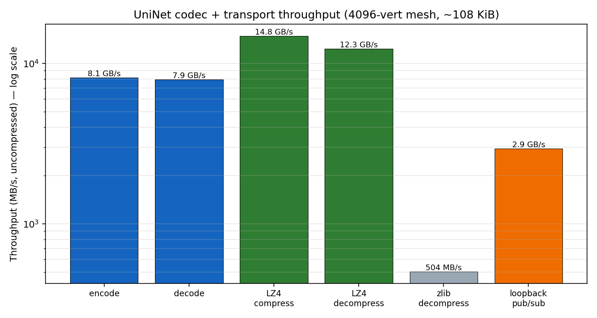
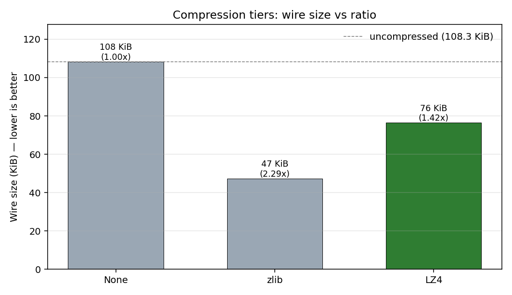

# UniNet

**Unified Networking transport** — one versioned pub/sub wire protocol for
distributed medical-navigation peers, with a compiled C++ core (CBOR codec,
negotiated compression, pluggable transport, high-level Node) and C# / Python
bindings. One codec, one framing, one bus — owned by this project; consumers
depend on UniNet rather than each re-implementing the bus.

It exists because an audit of ThermoNavMR (C#), ThermoNavServer (C++) and
ThermoNavSlicer (Python) found the **same** NATS+CBOR protocol re-implemented
**three times**, with hand-mirrored schemas and LZ4 code that nobody could enable
(no peer knew how a frame was encoded). UniNet is that bus, written once.

## What it is

A peer (`Node`) publishes/subscribes `Envelope`s over a pluggable `Transport`. The
envelope carries who-sent / who-for / subject / payload; the payload is an
arbitrary `Cbor` value. The codec, compression and protocol filters (echo
suppression, dst targeting, reconnect) live here, once — what each ThermoNav peer
hand-rolls today (`Networking.cs`, `networking.cpp`, `networking.py`).

- **v0.1 (current):** dependency-free CBOR codec + negotiated compression
  (none/zlib/lz4) + `LoopbackTransport` + `Node` + C ABI + Python + C# bindings.
- Layered so a new transport (NATS, mesh, BLE) is an addition, not a rewrite.

See [`docs/PROTOCOL.md`](docs/PROTOCOL.md) for the canonical wire standard.

## Installation

**One command does everything** — installs prerequisites, builds the C++ core, the
C ABI (for C#), optionally the Python extension, and runs the tests:

```bash
./scripts/bootstrap.sh --python     # Linux / macOS (use scripts/bootstrap.ps1 on Windows)
```

Prefer the manual route? It's plain CMake. Prerequisites: a **C++17** compiler,
**CMake ≥ 3.18**, and **zlib** + **liblz4** (lz4 is optional — auto-detected).

| OS | install prerequisites |
|---|---|
| **Ubuntu/Debian** | `sudo apt install build-essential cmake pkg-config zlib1g-dev liblz4-dev` |
| **Fedora** | `sudo dnf install gcc-c++ cmake pkgconf-pkg-config zlib-devel lz4-devel` |
| **Arch** | `sudo pacman -S base-devel cmake pkgconf zlib lz4` |
| **macOS** | `brew install cmake pkg-config zlib lz4` |
| **Windows** | `scripts/bootstrap.ps1` (auto-clones vcpkg for zlib + lz4); needs Git, CMake, and VS 2022's "Desktop development with C++" workload |

Then build:

```bash
cmake -S . -B build -DCMAKE_BUILD_TYPE=Release -DUNINET_BUILD_CABI=ON
cmake --build build -j
ctest --test-dir build                                   # codec / compression / pub-sub tests
```

On **Windows**, point CMake at the vcpkg toolchain:
```powershell
cmake -S . -B build -G "Visual Studio 17 2022" -A x64 `
      -DCMAKE_TOOLCHAIN_FILE="$env:VCPKG_ROOT/scripts/buildsystems/vcpkg.cmake" `
      -DUNINET_BUILD_CABI=ON
cmake --build build --config Release
ctest --test-dir build -C Release
```

CMake options (all optional, auto where possible):
- `UNINET_LZ4=ON` — LZ4 tier (auto-detected via pkg-config/vcpkg). Falls back to zlib + none.
- `UNINET_NATS=ON` — builds `NatsTransport` (fetches cnats; the production brokered backend). Off by default.
- `UNINET_BUILD_CABI=ON` — `libuninet_c.so/.dll/.dylib` (the C ABI for C# / P-Invoke).
- `UNINET_BUILD_PYTHON=ON` — the pybind11 extension (set automatically by `pip install`).

### Python

```bash
pip install .                      # builds the C++ extension via scikit-build-core
# editable:
pip install -e .
```

```python
import uninet
bus = uninet.LoopbackTransport(); bus.connect()
a = uninet.Node("alice", bus); b = uninet.Node("bob", bus)
a.connect(); b.connect()
b.subscribe("domain.D1", lambda env: print("got", env.data["text"].as_text()))
a.publish("domain.D1", uninet.Cbor.map().set("text", uninet.Cbor.text("hi")))
# -> got hi
```

### C# / Unity (HoloLens)

1. Build the C ABI with `-DUNINET_BUILD_CABI=ON` → produces `libuninet_c.so` /
   `uninet_c.dll` / `libuninet_c.dylib`.
2. Reference `csharp/UniNet/UniNet.csproj` (P/Invoke) from your app, or run the demo:
   ```bash
   cd csharp/UniNetDemo && dotnet run        # after `dotnet build` (place the native lib next to the exe)
   ```
3. For Unity/HoloLens: drop the native lib (an **ARM64** build for the headset) into
   your `Assets/Plugins/` folder. This is the binding the MR headset needs and that
   UniVox never had.

```csharp
using var bus = new LoopbackTransport();
using var a = new Node("alice", bus);
using var b = new Node("bob", bus);
b.Subscribe("domain.D1", (subj, text) => Console.WriteLine($"{subj}: {text}"));
a.Publish("domain.D1", "hello from C# over UniNet");
```

### Troubleshooting
- **`'pybind11/pybind11.h' not found`** — `pip install pybind11`, then pass
  `-Dpybind11_DIR=$(python3 -m pybind11 --cmakedir)` (the bootstrap script does this for you).
- **LZ4 not detected** — install `liblz4-dev` / `lz4-devel` / `brew install lz4`; otherwise
  UniNet builds with zlib + none (the `Lz4` rows are simply omitted from the benchmark).
- **`libuninet_c.so: cannot open shared object file`** (C#/Python) — add its directory to
  `LD_LIBRARY_PATH`, or on Windows place `uninet_c.dll` next to your executable.

## Layout

```
include/uninet/   types.h · cbor.h (codec) · codec.h (envelope+compression)
                  · transport.h · loopback.h · node.h · nats_transport.h
                  · cabi.h (C ABI) · profiler.h · schema.h (ThermoNav tags)
src/              cbor · codec · loopback · node · profiler · nats_transport · cabi
python/           bindings.cpp (pybind11) · uninet/ (package)
csharp/           UniNet/ (P/Invoke wrapper) · UniNetDemo/ (demo)
scripts/          bootstrap.sh (Linux/macOS) · bootstrap.ps1 (Windows)
tests/            round-trip + pub/sub correctness (C++) · benchmark.cpp
docs/             PROTOCOL.md (canonical wire spec) · benchmark_*.png
tools/            plot_benchmark.py
```

## Performance & diagnostics

UniNet ships the same opt-in profiler UniVox uses (`uninet.profiler`): a zero-cost
`ScopedOp` RAII timer placed at the **operation** level of every hot path
(`cbor.encode`, `cbor.decode`, `compress.*`, `decompress.*`, `frame`, `unframe`,
`node.publish`, `loopback.deliver`). Enable it, run a workload, read the per-op
breakdown sorted by total time — the dominant cost is always at the top.

The benchmark is a **collect-then-plot pipeline**: it runs the full pipeline matrix
(encode → compress → frame → deliver → unframe → decode) at three mesh sizes,
**appends every run to `uninet_bench_log.csv`** (so runs accumulate for before/after
comparison), and dumps the profiler report to `uninet_profile.txt` with a
`DOMINANT op` callout pointing at the next lever to pull.

```bash
cmake -S . -B build -DCMAKE_BUILD_TYPE=Release && cmake --build build -j --target benchmark
./build/benchmark 200 2000          # CSV to stdout + uninet_bench_log.csv + uninet_profile.txt
python3 tools/plot_benchmark.py     # reads the CSV -> regenerates docs/benchmark_*.png
```





4096-vert mesh (~108 KiB uncompressed CBOR, mean of 200 reps, 32-core box):

| op | throughput | notes |
|---|---|---|
| **encode** | **8.1 GB/s** | bulk-write fast path (was 1.3 GB/s — see below) |
| **decode** | **7.9 GB/s** | memory-bandwidth-bound (bulk float-array fast path) |
| **frame** | 5.0 GB/s | encode + compress |
| **unframe** | 4.2 GB/s | decompress + decode |
| **LZ4 compress** | **14.8 GB/s** (ratio 1.42×) | 108 KiB → 76 KiB on the wire |
| **LZ4 decompress** | **12.3 GB/s** | |
| zlib compress | 36 MB/s (ratio 2.29×) | 108 KiB → 47 KiB — best ratio, too slow for live |
| zlib decompress | 504 MB/s | |
| **loopback pub/sub** | **27.8k msgs/s · 2.93 GB/s** | full encode→unframe→dispatch round-trip |

**Two profiler-driven wins so far (loopback 8.5k → 27.8k msgs/s = 3.3×):**

1. **`cbor.encode` 6× win.** The first profile flagged encoding as the dominant cost —
   1.3 GB/s vs decode's 7.8 (6× slower), 86% of framing time. Cause: the float-array
   path did one `push_back` per byte (61k calls + reallocs) while decode read bulk.
   Switching encode to pre-size and write directly lifted it to **8.1 GB/s** and
   doubled loopback (every publish pays the encode cost).

2. **Echo suppression without decompress.** The next profile showed
   `unframe`/`decode`/`decompress` running **4000× for 2000 publishes** — each
   publisher was decoding its *own echo* then discarding it, and with compression on
   it had to decompress first just to read `src`. Fix: put `src`/`dst`/compression in
   a **clear binary header** before the compressed core (`peek_routing`), so
   `Node::on_raw_` drops echoes *before* touching the payload. `unframe` calls halved
   (4k → 2k) and loopback rose another **+45%** (17.7k → 27.8k).

Both wins came straight from the breakdown — total profiled time dropped 65% over
the two changes, and the per-op table now shows the cost is **balanced** (no single
dominant leaf: `node.publish` 30% aggregate, `loopback.deliver`/`unframe` ~16% each,
`frame` ~14%). That balance is the signal that the easy wins are exhausted and the
remaining work is a design trade-off (the `loopback.deliver` safety copy, async
dispatch) rather than a bug.

**What the tier numbers say:**
- **LZ4 is essentially free and should stay on for every frame** — 14.6 GB/s with a
  real 1.4× cut. This is the lever the three ThermoNav peers *already coded* but
  force-disabled to `NONE` everywhere (no peer could tell how a frame was encoded);
  UniNet's 1-byte compression header fixes that.
- **zlib's better ratio (2.3×) isn't worth it live** — 36 MB/s compress is ~400×
  slower than LZ4. Reserve zlib for archival/batch, LZ4 for the OR.
- The protocol layer is not the bottleneck at any realistic rate (the MR peer
  throttles to ~20 Hz today; UniNet sustains ~17k pub/sub round-trips/s).

Compression level is tunable at runtime (`uninet.set_compression_level(1..9)` for
zlib; default 6).

## Status (v0.1)

**Verified:** CBOR round-trips (all kinds, incl. fast float arrays), zlib + LZ4
compression round-trips, envelope frame/unframe, loopback pub/sub (echo suppression,
dst targeting, wildcard), reconnect-with-backoff, profiler, Python bindings
(`pip install`), C ABI + C# wrapper, builds CPU-only with no broker required.

**Staged (documented, not in v0.1):** the `NatsTransport` wired into a live
benchmark against a broker; mesh discovery + BLE backends behind the `Transport`
interface; a managed CBOR surface for C# (today the C ABI exchanges text/bytes);
cross-platform wheels via CI (`cibuildwheel`) and a NuGet package; and migrating
ThermoNavMR / ThermoNavServer / ThermoNavSlicer off their in-tree copies onto this
package — the same staged migration UniVox used for its on-disk format.

## License

MIT.
